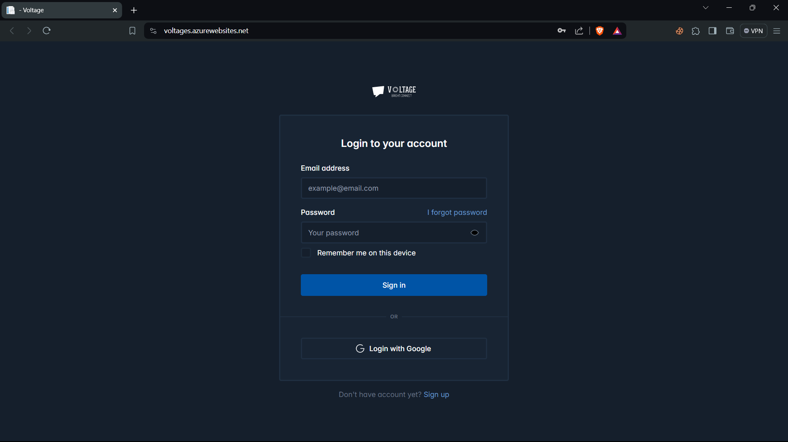
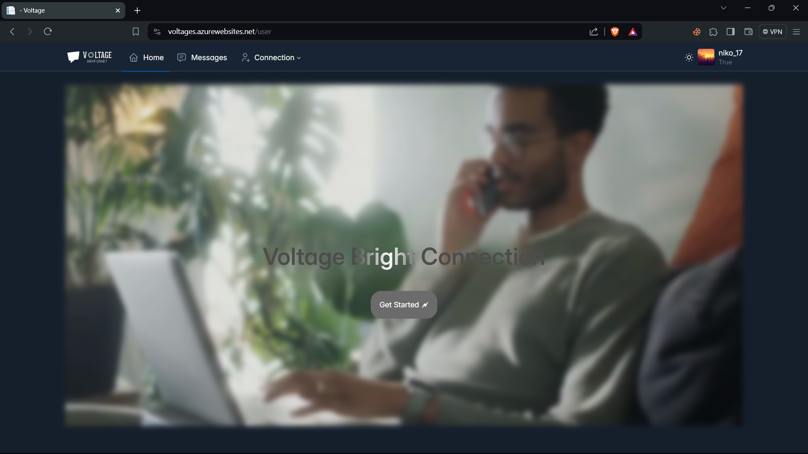
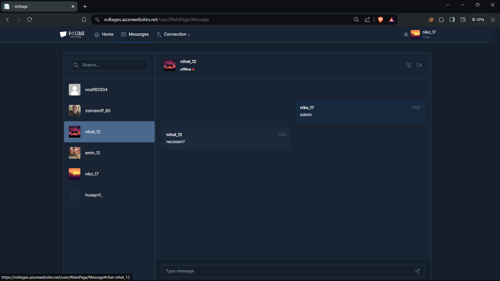

# Voltages Chat

Welcome to Voltages Chat! This is a simple chat website where you can connect with others in real-time.

## Features

- **Real-time Communication:** Chat with others instantly without needing to refresh the page.
- **Simple Interface:** Clean and intuitive design for ease of use.
- **Secure:** Your conversations are encrypted for privacy and security.
- **Responsive:** Access the chat from any device, whether it's a desktop, tablet, or smartphone.

## Getting Started

1. Visit [Voltages Chat](https://voltages.azurewebsites.net/) in your web browser.
2. Enter your desired username.
3. Start chatting with others in real-time!

## Screenshots

## Feedback

We would love to hear your feedback! If you have any suggestions or encounter any issues, please feel free to [open an issue](https://github.com/yourusername/voltages-chat/issues) on GitHub.

## Contributing

If you'd like to contribute to this project, fork the repository and submit a pull request. We welcome any improvements or new features!

## License

This project is licensed under the MIT License - see the [LICENSE](LICENSE) file for details.

---

Developed with ❤️ by [Your Name](https://github.com/yourusername)
